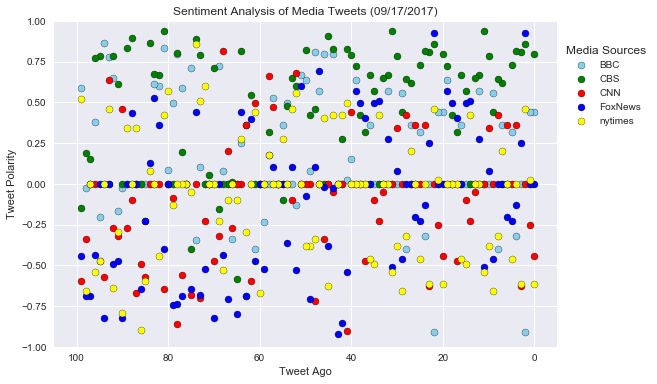
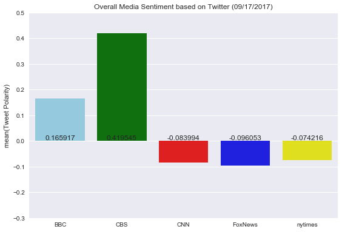

# The News Mood Analysis


By Analyzing the last 100 twitter contents from 5 major media news company, the BBC and CBS showing more positive tones. However, the last 100 twitter contents depend on the events happening in the world and what the news was reporting.


```python
# Dependencies
import tweepy
import json
import numpy as np
import pandas as pd
import matplotlib.pyplot as plt
import seaborn as sns
import re
import string
import datetime
sns.axes_style('darkgrid')
sns.set_style('darkgrid')
# Import and Initialize Sentiment Analyzer
from vaderSentiment.vaderSentiment import SentimentIntensityAnalyzer
analyzer = SentimentIntensityAnalyzer()

# Twitter API Keys
consumer_key = ""
consumer_secret = ""
access_token = ""
access_token_secret = ""

# Setup Tweepy API Authentication
auth = tweepy.OAuthHandler(consumer_key, consumer_secret)
auth.set_access_token(access_token, access_token_secret)
api = tweepy.API(auth, parser=tweepy.parsers.JSONParser())
```


```python
#create a empty dataframe
df=pd.DataFrame()

# Target User Accounts
target_user = ("@BBC", "@CBS", "@CNN","@FoxNews","@nytimes")

# Loop through each user
for user in target_user:
    
    tweet_count=1
    # Variables for holding sentiments
    compound_list  = []    
    
    # Loop through pages of tweets (total 100 tweets)
    for x in range(8): 
        if  tweet_count < 101:
            # Get all tweets from home feed        
            public_tweets = api.user_timeline(user,page=x)
            #print(public_tweets) 
            for tweet in public_tweets:
                text = tweet['text']
                #print(text)
                # Run Vader Analysis on each tweet
                compound = analyzer.polarity_scores(text)["compound"]
                # Add each value to the appropriate array
                compound_list.append(compound) 
                
                tweet_count +=1
          
    
    # Generate column name and data
    user1=user.translate({ord(i):None for i in '!@#$'}) 
    title="%s" % user1
    #print(title)
    df[title]= compound_list
    
#Save data to csv file
df.to_csv('NewMood.csv')
df.head()    
```


<div>
<style>
    .dataframe thead tr:only-child th {
        text-align: right;
    }

    .dataframe thead th {
        text-align: left;
    }

    .dataframe tbody tr th {
        vertical-align: top;
    }
</style>
<table border="1" class="dataframe">
  <thead>
    <tr style="text-align: right;">
      <th></th>
      <th>BBC</th>
      <th>CBS</th>
      <th>CNN</th>
      <th>FoxNews</th>
      <th>nytimes</th>
    </tr>
  </thead>
  <tbody>
    <tr>
      <th>0</th>
      <td>0.4404</td>
      <td>0.7974</td>
      <td>-0.4404</td>
      <td>0.0000</td>
      <td>-0.6124</td>
    </tr>
    <tr>
      <th>1</th>
      <td>0.4404</td>
      <td>0.0000</td>
      <td>-0.2500</td>
      <td>0.0000</td>
      <td>0.0258</td>
    </tr>
    <tr>
      <th>2</th>
      <td>-0.9100</td>
      <td>0.8588</td>
      <td>0.0000</td>
      <td>0.9224</td>
      <td>0.4588</td>
    </tr>
    <tr>
      <th>3</th>
      <td>0.0000</td>
      <td>0.8087</td>
      <td>-0.6249</td>
      <td>0.2500</td>
      <td>-0.6124</td>
    </tr>
    <tr>
      <th>4</th>
      <td>-0.3182</td>
      <td>0.8126</td>
      <td>0.3612</td>
      <td>-0.1280</td>
      <td>0.0000</td>
    </tr>
  </tbody>
</table>
</div>


```python
#Genrate date
dt = datetime.datetime.now().strftime('%m/%d/%Y')
# Build a scatter plot for each data type
plt.scatter(df.index, df["BBC"], color="skyblue", edgecolor="black", marker="o")
plt.scatter(df.index, df["CBS"], color="green", edgecolor="black", marker="o")
plt.scatter(df.index, df["CNN"], color="red", edgecolor="black", marker="o")
plt.scatter(df.index, df["FoxNews"], color="blue", edgecolor="black", marker="o")
plt.scatter(df.index, df["nytimes"], color="yellow", edgecolor="black", marker="o")

plt.legend(loc='center left', bbox_to_anchor=(1,0.8), title="Media Sources")
# Incorporate the other graph properties
plt.title("Sentiment Analysis of Media Tweets (" + dt + ")")
plt.ylabel("Tweet Polarity")
plt.xlabel("Tweet Ago")
plt.grid(True)
plt.xlim([105, -5])
plt.ylim([-1.0, 1.0])

# Save the figure
plt.savefig("Sentiment_Analysis_Media_Tweets.png")

# Show plot
plt.tight_layout()
plt.show()
```





```python
df_mean=df.mean().to_frame()
df_mean.columns = ['Tweet Polarity']
df_mean
```


<div>
<style>
    .dataframe thead tr:only-child th {
        text-align: right;
    }

    .dataframe thead th {
        text-align: left;
    }

    .dataframe tbody tr th {
        vertical-align: top;
    }
</style>
<table border="1" class="dataframe">
  <thead>
    <tr style="text-align: right;">
      <th></th>
      <th>Tweet Polarity</th>
    </tr>
  </thead>
  <tbody>
    <tr>
      <th>BBC</th>
      <td>0.165917</td>
    </tr>
    <tr>
      <th>CBS</th>
      <td>0.419545</td>
    </tr>
    <tr>
      <th>CNN</th>
      <td>-0.083994</td>
    </tr>
    <tr>
      <th>FoxNews</th>
      <td>-0.096053</td>
    </tr>
    <tr>
      <th>nytimes</th>
      <td>-0.074216</td>
    </tr>
  </tbody>
</table>
</div>


```python
# Configure plot and ticks
plt.title("Overall Media Sentiment based on Twitter (" + dt + ")")
plt.ylabel("Tweet Polarity")
plt.ylim(-0.3, 0.5)
x=df_mean.index
y=df_mean['Tweet Polarity']


colors = ['skyblue','green','red','blue','yellow']
ax = sns.barplot(x, y, palette=colors)


for n, (label, _y) in enumerate(zip(x, y)):   
    ax.annotate(
        s=(str(round(_y,7))),
        xy=(n, 0),
        ha='center',va='top',
        xytext=(0,10),
        textcoords='offset points',
    ) 
    
# Save the figure
plt.savefig("Overall_Media_Sentiment_Twitter.png")

plt.tight_layout()
plt.show()
```




